# 製造業データモデル 設計図 (Target ER Diagram)

将来的に目指す完成想定図（Target State）のER図です。
ここに記載されたモデルを元に、要件定義とDBMLへの変換を進めていきます。

```mermaid
erDiagram
%% 製造業データモデル ER図 - Version 3.0 (Full Scope & Latest Identity/RBAC)

%% -------------------- I. 基礎・取引先マスタ --------------------
"商品マスタ" {
    INT 商品_ID PK "連番 内部キー"
    VARCHAR 商品_コード "業務コード" 
    VARCHAR 商品名 "基材または完成品を登録"
    VARCHAR 在庫単位 "商品の在庫 出荷管理単位"
    VARCHAR 状態区分 "基材 半商品 完成品など"
}

"工程マスタ" {
    INT 工程_ID PK "内部キー"
    INT 工程_コード "業務コード"
    VARCHAR 工程名
}

"スキルマスタ" {
    INT スキル_ID PK "内部キー"
    VARCHAR スキル_コード "業務コード"
    VARCHAR スキル名
}

"相手先名称マスタ" {
    INT 取引先_ID PK "内部キー"
    VARCHAR 取引先_コード "業務コード"
    VARCHAR 取引先名 "仕入先や得意先を兼ねる"
}

"発送先マスタ" {
    INT 発送先_ID PK "内部キー"
    VARCHAR 取引先_コード FK "親得意先または親仕入先 業務コード"
    VARCHAR 発送先_コード "業務コード"
    VARCHAR 発送先名 "自社の納品拠点を登録する場合もある"
    VARCHAR 住所
}

"ロケーションマスタ" {
    INT id PK
    INT 拠点ID FK "所属拠点(site_id)"
    VARCHAR 場所コード "場所コード (例: W001-S01-A)"
    VARCHAR 場所名 "場所名 (例: 倉庫A-棚B1)"
    DATETIME 廃止日時 "discarded_at"
}

"品番マスタ" {
    INT 品番_ID PK "内部キー"
    VARCHAR 品番 "業務コード"
    VARCHAR 品名 "原材料や資材"
    VARCHAR メーカー名
    VARCHAR 在庫単位
    BOOLEAN ロット管理対象
}

"技術情報マスタ" {
    INT 技術_ID PK "内部キー"
    VARCHAR 品番 FK "業務コード"
    VARCHAR 推奨保管温度
    VARCHAR 危険物区分
}

%% -------------------- II. 品質基準マスタ --------------------

"検査項目マスタ" {
    INT 検査項目_ID PK "内部キー"
    VARCHAR 検査項目_コード "業務コード"
    VARCHAR 検査項目名
}

"標準検査基準マスタ" {
    INT 標準検査基準ID PK "内部キー"
    VARCHAR 商品_コード FK "商品マスタを参照"
    INT 工程_コード FK
    VARCHAR 検査項目_コード FK
    VARCHAR 品質グレード "品質等級"
    DECIMAL 基準値_最小
    DECIMAL 基準値_最大
}

"個別検査基準マスタ" {
    INT 個別検査基準ID PK "内部キー"
    VARCHAR 取引先_コード FK
    VARCHAR 商品_コード FK "商品マスタを参照"
    VARCHAR 検査項目_コード FK
    VARCHAR 品質グレード "品質等級"
    DECIMAL 基準値_最小
    DECIMAL 基準値_最大
}

%% -------------------- III. ユーザー・組織・履歴管理 (HR & Organization) --------------------

"ユーザーマスタ" {
    INT id PK "users: 個人情報"
    VARCHAR ユーザー_コード "ログインID"
    VARCHAR 名前 "氏名"
    VARCHAR 暗号化パスワード "password_digest"
    INT ユーザーカテゴリ "user_category: 0内 10外 80サ"
    INT 雇用形態 "employment_type: 0正 20派遣等"
    INT 取引先ID FK "雇用元BusinessPartner参照"
    DATETIME 廃止日付 "discarded_at"
}

"拠点マスタ" {
    INT id PK "sites: 営業拠点・拠点(Site)"
    VARCHAR 拠点コード "コード"
    VARCHAR 拠点名 "名称"
    VARCHAR 郵便番号
    VARCHAR 住所
    VARCHAR 電話番号
    DATETIME 廃止日時 "discarded_at"
}

"組織単位マスタ" {
    INT id PK "org_units: 部署・PJ・委員会"
    INT 親組織ID FK "parent_id (階層構造)"
    VARCHAR 組織コード "コード"
    VARCHAR 組織名 "名称"
    INT 組織種別 "0:部署, 1:PJ, 2:委員会"
}

"組織権限マスタ" {
    INT id PK "org_unit_permissions: 権限定義"
    INT 組織単位ID FK
    INT 役割ID "role: 100単位ブロック (ADR 009)"
    VARCHAR 権限キー "permission_key"
    INT 権限レベル "permission_level: 0R 1E 2A"
}

"配属辞令履歴" {
    INT id PK "assignments: 人事履歴"
    INT ユーザーID FK "user_id"
    INT 拠点ID FK "site_id"
    INT 組織単位ID FK "org_unit_id"
    VARCHAR 役職名 "job_title (肩書き)"
    INT 役割ID "role: 100単位ブロック (ADR 009)"
    BOOLEAN 主属フラグ "is_primary (メイン所属)"
    DATE 開始日 "start_date"
    DATE 終了日 "end_date"
}

"セッションマスタ" {
    INT id PK "sessions: 認証管理"
    INT ユーザーID FK
    VARCHAR IPアドレス
    VARCHAR ユーザーエージェント
}

"ユーザースキル関連" {
    INT id PK
    INT ユーザーID FK
    INT SKILL_ID FK
}

"人員賃率データ" {
    INT id PK
    INT ユーザーID FK
    DECIMAL 標準賃率
}

"標準レシピマスタ" {
    INT レシピ_ID PK "内部キー"
    VARCHAR レシピ_コード "業務コード"
    VARCHAR 商品_コード FK "完成品"
    VARCHAR 基材_商品_コード FK "インプット"
}

"商品構成・消費データ" {
    INT 構成_ID PK "内部キー"
    VARCHAR 商品_コード FK
    INT 工程_コード FK
    VARCHAR 品番 FK
    DECIMAL 標準消費量
}

%% -------------------- IV. 仕入・在庫管理トランザクション --------------------

"見積データ" {
    INT id PK
    VARCHAR 品番 FK
    VARCHAR 取引先_コード FK
    DECIMAL 見積単価
}

"発注データ" {
    INT id PK
    DATE 発注日
    VARCHAR 取引先_コード FK
}

"入荷明細データ" {
    INT id PK
    INT 入荷コード FK
    DECIMAL 在庫換算数量
}

"在庫データ" {
    INT id PK "inventories"
    INT 品番ID FK "item_id"
    INT 組織ユニットID FK "論理所有"
    INT ロケーションID FK "物理場所"
    DECIMAL 在庫数量 "quantity"
}

"在庫移動データ" {
    INT id PK "inventory_moves"
    VARCHAR 移動タイプ "move_type"
    INT 品目ID FK
    DECIMAL 移動数量
    INT 元ロケーションID FK
    INT 先ロケーションID FK
}

%% -------------------- V. 受注・販売管理トランザクション --------------------
"受注データ" {
    INT 受注_ID PK "内部キー"
    INT 受注_コード "業務コード"
    VARCHAR 取引先_コード FK "得意先参照"
}

"受注明細データ" {
    INT 受注明細_ID PK
    INT 受注_コード FK
    VARCHAR 商品_コード FK "完成品"
    VARCHAR 発送先_コード FK "納入先"
}

%% -------------------- VI. 生産・実績トランザクション --------------------
"作業指示データ" {
    INT 指示_ID PK
    INT 指示_コード "業務コード"
    INT 工程_コード FK
}

"作業実績データ" {
    INT 実績_ID PK
    VARCHAR ユーザー_コード FK "ユーザー参照"
    DATETIME 開始日時
    DATETIME 完了日時
    VARCHAR 総合合否
}


%% -------------------- VII. リレーションシップ 定義 --------------------
"相手先名称マスタ" ||--o{ "発送先マスタ" : 複数発送先
"BusinessPartner" ||--o{ "ユーザーマスタ" : 雇用元
"品番マスタ" ||--|| "技術情報マスタ" : 技術情報
"商品マスタ" ||--o{ "標準レシピマスタ" : 完成品
"商品マスタ" ||--o{ "商品構成・消費データ" : 構成元
"工程マスタ" ||--o{ "商品構成・消費データ" : 構成
"品番マスタ" ||--o{ "商品構成・消費データ" : 消費品
"商品マスタ" ||--o{ "標準検査基準マスタ" : 適用商品
"工程マスタ" ||--o{ "標準検査基準マスタ" : 適用工程
"拠点マスタ" ||--o{ "ロケーションマスタ" : 拠点内の場所

"ユーザーマスタ" ||--o{ "配属辞令履歴" : 履歴
"拠点マスタ" ||--o{ "配属辞令履歴" : 拠点配属
"組織単位マスタ" ||--o{ "配属辞令履歴" : 組織所属
"組織単位マスタ" ||--o{ "組織単位マスタ" : 組織階層
"組織単位マスタ" ||--o{ "組織権限マスタ" : 権限定義
"ユーザーマスタ" ||--o{ "セッションマスタ" : 認証

"相手先名称マスタ" ||--o{ "受注データ" : 得意先
"受注データ" ||--o{ "受注明細データ" : 構成
"商品マスタ" ||--o{ "受注明細データ" : 受注商品
"発送先マスタ" ||--o{ "受注明細データ" : 納入先
"受注明細データ" ||--o{ "作業指示データ" : 依頼元
"生産指示データ" ||--o{ "作業実績データ" : 実現
"ユーザーマスタ" ||--o{ "作業実績データ" : 実行者

"ロケーションマスタ" ||--o{ "在庫データ" : 配置
"組織単位マスタ" ||--o{ "在庫データ" : 所有
"ロケーションマスタ" ||--o{ "在庫移動データ" : 移動元
"ロケーションマスタ" ||--o{ "在庫移動データ" : 移動先
"在庫データ" ||--o{ "在庫移動データ" : 原価元

```

### 1. ユーザー・組織マスタ
| テーブル名 | 物論名 | 説明 |
| :--- | :--- | :--- |
| ユーザーマスタ | users | 個人情報の主体。Identity Taxonomy 対応。 |
| 拠点マスタ | sites | 物理的な拠点（工場・支店）。Site への改称と属性拡充。 |
| 組織単位マスタ | org_units | 部・課・プロジェクト等の論理組織。 |
| 組織権限マスタ | org_unit_permissions | 階層継承 RBAC モデルの定義。 |
| 配属辞令履歴 | assignments | 誰が・どこで・どの役割(Role ID)を担っているかの履歴。 |
